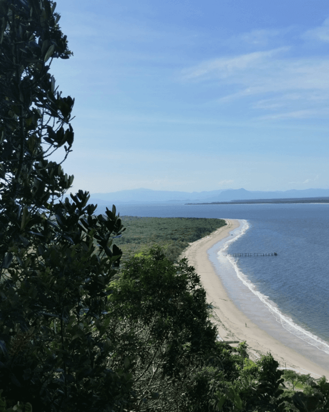
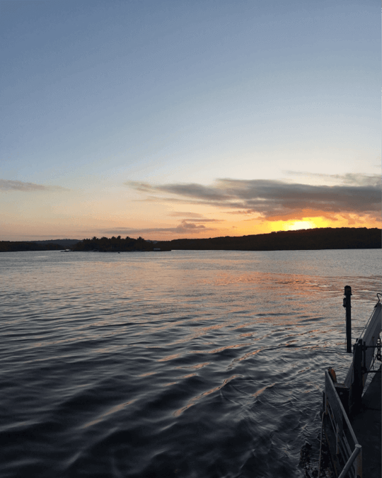

## Fev 24

Fevereiro foi bem rotineiro. Finalizei mais um ano letivo no IF (falta o último ano). Festei alguns aniversários (um até demais). Me despedi de alguns amigos que se mudaram por conta dos estudos, e comemorei o carnaval "longe dos perigos noturnos".

Voltei a - lentamente - ler. Escolhi o primeiro romance de Fernando Sabino "O Encontro Marcado". Li 1/3 dele, e já posso dizer que é uma das coisas mais diferentes que já consumi, sua escrita possui um ritmo autêntico e atual, tanto que, só fui saber depois que se tratava de uma obra de 1956. Espero terminá-lo logo.

Março entrarei de férias, portanto, espero colocar em prática as coisas que comentei em janeiro, e outras que pensei nesse mês.



```tex
Foto: Clara Figueiredo / Ilha do Mel - PR
```

### 📌 Updates

Adicionei SFX no [Scot Scot](https://www.thenzolima.com.br/scotscot/)

Atualizei a UI do [meu site pessoal](https://www.thenzolima.com.br/)

Rascunhei a interface de um [projeto](https://github.com/thenzolima/caixadagua) que verifica o quanto de água tem em uma caixa d'água.

### ☂️ Filmes

Não vi muitos, mas os que eu vi foram ótimos, destaco:

[Good Will Hunting (1997)](https://letterboxd.com/film/good-will-hunting/) [4.5/5]: Me deu vontade de estudar kk.

[The Iron Claw (2023)](https://letterboxd.com/film/the-iron-claw-2023/) [4.5/5]: ["*little women* for boys"](https://letterboxd.com/kenzvanunu/film/the-iron-claw-2023/).

[Poor Things (2023)](https://letterboxd.com/film/poor-things-2023/) [4.5/5]: É bom mesmo.

## Jan 24

Foi um bom início de ano. Aproveitei o tempo sem aula para viajar, tanto que, quase não estive em casa durante o mês. Isso fez com que eu não tivesse muito tempo de produzir. Felizmente, planejei bastante coisa.

É uma ideia parecida com o que eu já escrevi [neste post](https://jardim.thenzolima.com.br/posts/use-as-ferias/), férias pode - e deve - ser uma recarga criativa.

Estou com algumas metas envolvendo projetos pessoais e criação de conteúdo em outros formatos. Algo que facilita a execução de ambas as coisas é que elas são complementares, então na teoria, não terei dificuldade em balancear o foco.



```tex
Foto: Arquivo Pessoal / Porto Seguro - BA
```

### 📌 Updates

Publiquei a versão 1.0 do [guia](https://jardim.thenzolima.com.br/docs/criando-e-sincronizando-um-reposit%C3%B3rio-git-no-github.pdf) sobre criação de um repositório no github usando git.

Melhorei a interface dos meu projeto pessoais: [LCC](https://www.thenzolima.com.br/LCC/) e [posterpack](https://www.thenzolima.com.br/posterpack/).

Fiz correções e melhorias no [Scot Scot](https://www.thenzolima.com.br/scotscot/).

### ☂️ Filmes

Assisti 15 filmes neste mês. Entre os destaques:

[Do the Right Thing (1989)](https://letterboxd.com/film/do-the-right-thing/) [4.5/5]: Primeiro filme do Spike Lee que vejo, e o Chorão estava certo -  é verdadeiro, complicado, mal humorado e violento.

[Willy Wonka & the Chocolate Factory (1971)](https://letterboxd.com/film/willy-wonka-the-chocolate-factory/) [4.5/5]: O fator mágico desse filme é cativante e te impulsiona até o final, mesmo que você já saiba o que irá acontecer.

[Eu Sei que Vou te Amar (1986)](https://letterboxd.com/film/love-me-forever-or-never/) [4/5]: Uma obra com boa narrativa, elenco e estética. 