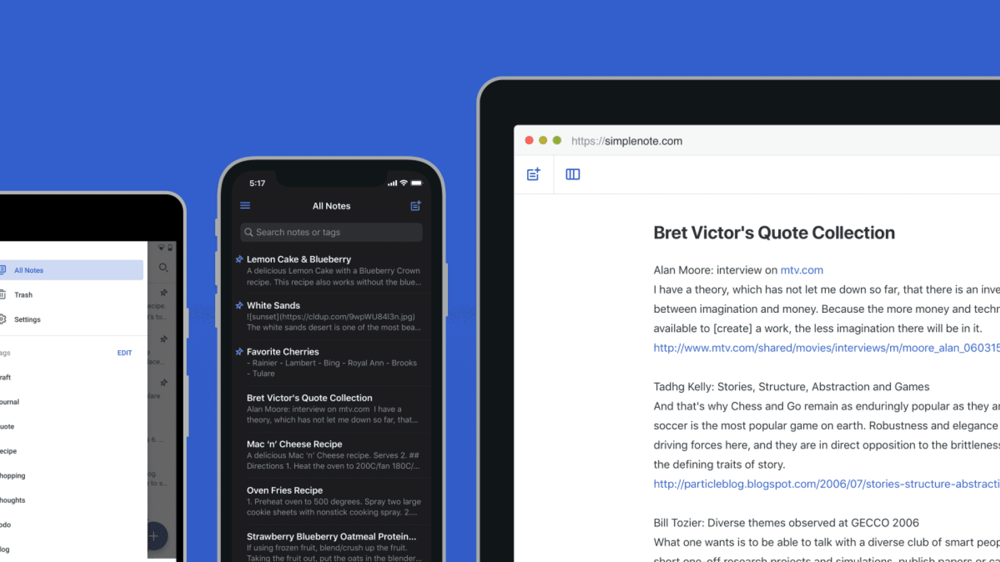
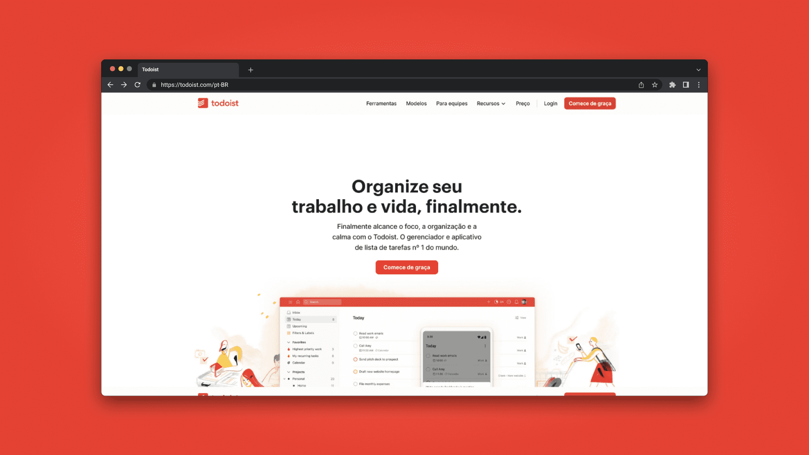
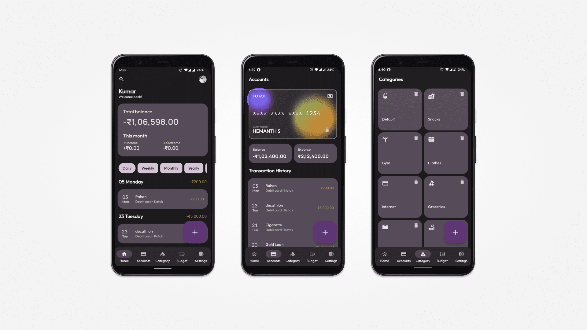
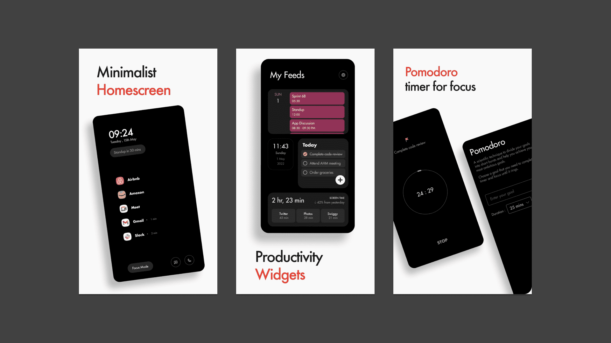

+++
title= "Aplicativos que uso para me organizar."
date= 2023-04-15
draft= false
tags= ["Open-Source","Organização","Markdown"]
categories= ["Listas"]
author= "Enzo Lima"
description= 'Indicações de bons aplicativos.'
+++

Faz um tempo que estou com a ideia de dedicar um texto para falar sobre os apps de organização que eu uso. Para mim, esse é um tópico bastante interessante e sempre acabo tocando no assunto enquanto faço os artigos, mas nunca me aprofundo para não fugir do tema principal.

Esse tipo de conteúdo é bastante presente nas redes sociais, e o Notion acaba sendo o destaque entre os criadores de conteúdo. Apesar de ser uma ótima ferramenta, deixei de usá-lo já faz um tempo (e irei explicar o motivo aqui).

Não tenho me apegado a softwares, já que busco sempre testar outras opções. Então pode ser que daqui a um tempo essa lista não faça mais sentido e eu esteja usando softwares totalmente diferentes.

Para mim, esse tema acaba sendo bastante difícil de escrever justamente por isso. Além da falta de tempo, o outro motivo da demora dessa publicação é essa questão de eu sempre trocar minhas ferramentas, e busco ser transparente nos meus textos.

Dito isso, vamos começar!

---

## Obsidian

O [Obsidian](https://obsidian.md/) traz a proposta de ser **o segundo cérebro do usuário**, ele é um software de anotações baseado em *markdown* que vem ganhando cada vez mais destaque. O programa permite que você faça ligações entre suas anotações e exiba isso graficamente, trazendo opções de agrupamento e filtros, com o intuito de inspirar o usuário enquanto escreve.

Tenho usado o software para produzir meus artigos e estudos, sua interface personalizável junto a função de ligações me fez aderi-lo, além de uma ótima versão mobile onde não precisa de internet para funcionar.

Entretanto, a opção de sincronização entre dispositivos está disponível apenas por uma assinatura paga (e em dólar), o que acaba não sendo atrativo para mim.

Mas como gambiarra a gente aceita, muitos usuários usam programas que permitem a sincronização de pastas entre dispositivos, fazendo com que os arquivos do Obsidian sejam sincronizados de “forma caseira” (recomendo o [syncthing](https://syncthing.net/) para isso por ser gratuito e open source).

Apesar da possibilidade ser bem viável, não pretendo aplicar no meu workflow. Mesmo sem sincronia, não deixa de ser uma ótima recomendação para quem estiver interessado em se organizar de uma maneira mais poderosa.

## Simplenote

O [Simplenote](https://simplenote.com/) é um aplicativo *FOSS* (Free Open Source Software) de anotações com suporte a *markdown*. Comecei a usar ele recentemente para anotações diárias, e provavelmente em um futuro próximo ele irá substituir o Obsidian no meu leque de softwares.

Digo isso pois a sincronia entre dispositivos no app é totalmente gratuita! (e bastante funcional). Então ele pode quebrar essa barreira que eu tenho em relação ao Obsidian.

Outra função que achei interessantíssima é a de você transformar sua anotação em um link onde qualquer pessoa pode acessar. Isso pode ser bastante útil para mim em algum momento.

Então, recomendo o Simplenote para quem busca produtividade em relação ao gerenciamento de suas anotações.

## Todoist

Seu nome já diz tudo, é um software de organização baseado em todo lists, e nele é possível: Categorizar e filtrar as tarefas por tópicos, criar subtarefas e escolher se o tópico será distribuído em lista ou tabelas.

Antes eu usava o [Todoist](https://todoist.com/) para organizar meus compromissos e finanças, mas atualmente uso apenas como agenda escolar. Mesmo tendo aplicativos focados nisso, por ser multi-device e ter uma organização de datas bastante prática, me fez optar por ele (além de ter um widget mostrando tudo isso que é muito útil).

O app é gratuito, mas possui assinaturas pagas para equipes ou alguém que esteja precisando de algo a mais. Nessas assinaturas, além do aumento de projetos e filtros que podem ser criados, lhe dá a possibilidade de fazer o upload de arquivos até 100mb e colocar mais de 20 colaboradores em apenas um projeto.

E durante a pesquisa para o artigo descobri que no próprio site do todoist tem [modelos de organização](https://todoist.com/pt-BR/templates), isso pode tanto guiar o usuário quanto dar ideias do que pode ser feito com o app.

## Paisa

Esse app vem sendo um dos melhores softwares que já usei! Fazia um tempo que estava em busca de um bom gerenciador de despesas, mas todos eram nada intuitivos e recheados de propagandas.

Foi então que achei o [Paisa](https://play.google.com/store/apps/details?id=dev.hemanths.paisa&hl=en_US), além dele ser open-source, seu diferencial é oferecer as mesmas funcionalidades que os outros apps da categoria, só que de forma gratuita, objetiva, simples, sem propagandas e moderna. O que faz toda diferença.

O Paisa consegue gerenciar o fluxo monetário de várias contas, sendo elas seus cartões ou seu dinheiro físico. Também te permite criar as categorias para os seus gastos e ver seu balanço a partir delas.

## Por que não uso mais o Notion

Bem, alguém já deve ter se perguntado: Pra que utilizar todos esses softwares se o [Notion](https://www.notion.so/) pode cobrir todos esses tópicos e ir além?

De fato, o app possui essas funções e acredito que uma organização mais centralizada poderia me trazer benefícios, sem contar que ele possui diversos materiais e dispensa qualquer apresentação por conta de sua popularidade. Mas por certos fatores acabo preferindo os softwares citados acima em suas propostas.

Usei unicamente o Notion para fins de organização e estudos durante a pandemia, só que com a volta a minha rotina presencial, o software acabou me trazendo algumas desvantagens.

Uma delas é a versão mobile, onde ele peca bastante. Passo grande parte do meu dia fora de casa, então poder gerenciar tudo pelo celular acaba sendo uma grande vantagem no meu dia. E todos os apps citados anteriormente possuem ótimas versões mobile.

Além de não ser nada fluido e intuitivo, a dependência com a internet acaba me limitando por eu nem sempre ter uma rede por perto. O aplicativo pode chegar a abrir, mas qualquer alteração feita offline não é salva.

Mas ainda acho um bom software, suas funções diversas é algo que permite o usuário ser bastante produtivo. Com o estouro das inteligências artificiais, houve a implementação do [Notion AI](https://www.notion.so/product/ai), onde é possível obter pesquisas completas sobre algum tópico com poucos cliques. E achei a ideia muito interessante.

## Bônus

Para finalizar esse texto, gostaria de recomendar mais um app que chamou a minha atenção pelo seu potencial. O [Flow Productivity Launcher](https://play.google.com/store/apps/details?id=com.app.flowlauncher&hl=en_US) tem a proposta de ser um launcher minimalista, focado em produtividade.

O software é consistente e possui funções como o *focus mode*, diversos utilitários na tela inicial e um sistema *pomodoro* implementado. Vale a pena experimentar!

---

Espero que tenha curtido a leitura. Não deixe de compartilhar para alguém próximo que pode se beneficiar lendo isso.
