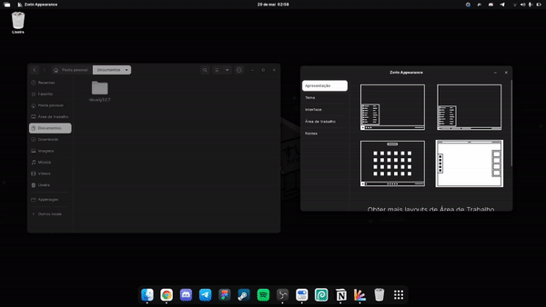

+++
title= "Minha experiência com Linux no Desktop."
date= 2022-07-03
draft= false
description= 'O uso de linux na vida de alguém nos dias de hoje é inevitável.'
+++

*Texto editado em: 26/08/2023*

---

O uso de linux na vida de alguém nos dias de hoje é inevitável. Por ser uma tecnologia flexível, podemos encontrá-la em diversos dispositivos e ambientes, como em computadores pessoais, setor onde sistemas baseados no pinguim tem ganhado cada vez mais destaque.

Mesmo que fatores como o fácil acesso a conteúdos introdutórios na internet e diversos computadores que possuem o pinguim como sistema nativo vem incentivando novos usuários a usarem e conhecerem mais sobre a tecnologia, ainda existe um preconceito por conta de seu passado.

Meu objetivo com este artigo é além de contar um pouco sobre como foi a minha experiência com sistemas linux, trazer algumas dicas que pode lhe trazer uma jornada mais tranquila no mundo linux. 

## Como tudo começou

Minha primeira experiência com Linux no desktop foi no meu antigo notebook com a versão 15 do [Deepin](https://www.deepin.org/index/en). Um amigo da época só me disse que era um sistema bonito, então baixei. Apesar de não ter entendido nada, me senti bastante interessado em saber mais sobre como aquilo funcionava.

Nesse período eu era dependente da Suíte Adobe, então meu contato com linux se baseava em máquinas virtuais e dual boots.

Foi no início de 2022 que adotei o pinguim para fins profissionais, escolares e casuais. Substitui o Photoshop e afins usando o [GIMP](https://www.gimp.org/), [Figma](https://www.figma.com/), [Inkscape](https://inkscape.org/) e [Photopea](https://www.photopea.com/). Meu workflow atual tem sido bastante leve e funcional, suprindo todas as minhas necessidades atuais.

## Por que migrei?

Estava cansado do Windows. Me sentia limitado em diversos aspectos, sem contar o uso excessivo de processamento. O Linux foi uma alternativa para resolver esses problemas. Tem sido gratificante usar a tecnologia, a possibilidade de testar várias distros, estudar o sistema, consumir e produzir conteúdo. Tudo isso é bastante divertido.

## O que já usei

Escolher uma distro principal foi um processo de alguns dias testando vários sistemas. Inicialmente fiquei no [Pop OS](https://pop.system76.com/).

Foi uma experiência agradável, a distribuição era fácil de mexer e bastante rápida (apesar de alguns bugs bem chatinhos envolvendo áudio e alguns softwares).

Até que decidi migrar para o [Zorin OS](https://zorin.com/os/download/), por muito tempo ele foi bastante eficiente. Seu primeiro boot proporciona uma introdução bastante clara e objetiva. O sistema disponibiliza também uma versão lite para computadores mais fraquinhos, com o XFCE de interface.

O “Zorin Appearance” se destaca entre os apps da distro, ele permite que você altere sua área de trabalho com apenas poucos cliques.

Um dos únicos pontos que me incomodou no Zorin é o fato de que edições atuais do próprio usa uma versão antiga do gnome, fazendo com que o sistema continue com alguns bugs da época, como leaks de ram.

Atualmente, estou alternando entre o [Debian](https://www.debian.org/index.pt.html) e o [Mint](https://linuxmint.com/). Ambos são práticos de usar e possuem versões atualizadas de drivers e interfaces gráficas.

## Indicação de vídeo



## E os jogos?

Com o aumento do suporte a jogos para Linux — sendo o [Steam Deck](https://store.steampowered.com/steamdeck/) um dos principais motivos disso acontecer — vem sendo cada vez mais prático jogar alguma coisa não nativa para o ambiente.

Isso se dá graças ao Proton, uma camada de compatibilidade que a Valve desenvolveu para jogos de Windows rodarem no Linux. Como é de código aberto, possui versões alternativas com implementos e correções de bugs para jogos específicos.

O [ProtonDB](https://www.protondb.com/) é um site onde você consegue ver e fornecer relatórios sobre o desempenho dos jogos com o Proton. Segundo o site:

> O objetivo do ProtonDB é coletar relatórios de outros jogadores enquanto eles testam jogos com o Proton no Linux e fornecer pontuações agregadas sobre o desempenho dos jogos. Um crescente conjunto de sugestões fornece ajustes que você pode tentar fazer os jogos funcionarem enquanto o Proton continua o desenvolvimento.

Como a Epic Game Store não tem versão nativa para Linux, a comunidade desenvolveu o [Heroic Games](https://heroicgameslauncher.com/), um launcher onde trás a sua biblioteca da Epic para o Linux, com compatibilidade a versões do Proton, e suporte a outras lojas como a do GOG.

## Prós de usar Linux

### Liberdade

Sendo uma tecnologia gratuita e de licença livre, faz com que o sistema seja seu, lhe dando a possibilidade de fazer o que quiser com ele. Essa tal liberdade pode lhe trazer alguns problemas, por isso é importante você ir adquirindo conhecimento sobre a tecnologia.

### Otimizado e leve

Quanto mais o tempo passa, menos acessível o Windows se torna em relação a hardwares mais fracos, sendo inviável instalar o sistema em máquinas desta categoria.

Portanto, pela variedade de interface gráfica (ou a falta dela), faz com que o pinguim se torne uma opção melhor para quem quer usufruir de um sistema mais otimizado, mesmo que tenha uma máquina high end.

### Personalização

Existem dois tipos de usuários Linux: O que não gosta de customizar o sistema e o que trata ele como se fosse um quebra-cabeça.

A tecnologia permite com que você possa modificar o visual de seu sistema a seu gosto, sendo a imaginação o seu único limite. Só cuidado para não quebrar o sistema dessa maneira.

Fica a recomendação o [r/unixporn](https://www.reddit.com/r/unixporn/).

### Compatibilidade com programas de Windows

Com softwares como o [Bottles](https://usebottles.com/), que usam o [Wine](https://www.winehq.org/) e outras camadas de compatibilidade, é possível rodar programas do sistema da Microsoft no ambiente Linux sem grandes problemas. Facilitando a vida de quem ainda não encontrou uma alternativa nativa de um software que goste.

### Drivers

A maioria das distribuições já vem com drivers genéricos embutidos, isso evita grande parte da preocupação em relação a isso. Cada vez mais eles vêm sendo aprimorados e recebendo suporte a novos dispositivos.

## Contras de usar Linux

### Bateria

Recentemente adquiri o notebook Ideapad 3i da Lenovo, e nos primeiros dias usando o Zorin OS, notei um uso considerável de bateria.

Pesquisando sobre, acabei descobrindo que o problema é comum e facilmente resolvido. O [autocpufreq](https://github.com/AdnanHodzic/auto-cpufreq) é um script que regula o clock do processador de forma adequada para consumir menos bateria (isso não interfere em praticamente nada no desempenho).

### Compatibilidade com dispositivos

Apesar de ter seus méritos, a questão de suporte a dispositivos no Linux é algo que tem muito o que melhorar. Entretanto, também temos que considerar que a migração de sistemas pode afetar nossas escolhas em relação aos dispositivos.

Podemos usar de exemplo as mesas digitalizadoras da Wacom, que mesmo não recebendo suporte oficial para o ambiente do pinguim, se dão bem com os drivers genéricos que já vem no sistema. Mas ainda há pendências, como a opção de configurar a área da mesa.

Por outro lado, as mesas digitalizadoras da XP Pen possuem suporte nativo a Linux. No final das contas, o que vale mais a pena para quem usa um ambiente com essa tecnologia?

Claro que essa lógica não funciona caso a pessoa já tenha o produto, mas a partir do momento que você troca de sistema, é importante que você pesquise o que funciona na sua máquina, e aceite as pendências, já que não é culpa do sistema, e sim da fabricante do dispositivo.

## Conclusão

De longe, a melhor experiência com computadores que já tive. Além de mudar o modo que eu vejo a tecnologia, tornou todo meu uso com softwares mais flexível e me mostrou que ainda tenho muito o que aprender.

---

Espero que você tenha gostado do texto. Não deixe de comentar e compartilhar com outras pessoas que têm interesse neste assunto.