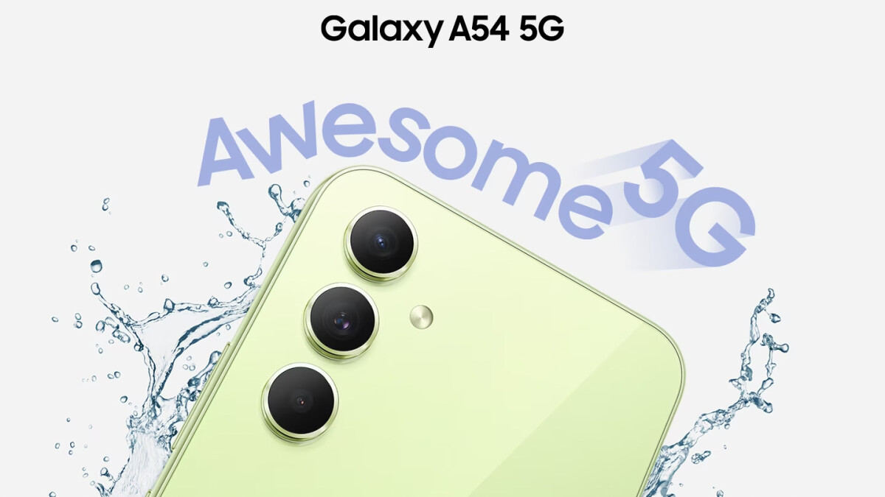

+++
title= "Trocando de celular."
date= 2023-10-11
draft= false
description= "Minha experiência trocando de smartphone." 
+++

Sempre estamos cercados por lançamento de smartphones, o que acaba sendo bastante atrativo, mesmo quando seu celular atual possua grande parte das funções do dispositivo que você vê nos anúncios.

Muitos diriam que esse sentimento acontece principalmente nas pessoas que são entusiastas na área, só que eu discordo. O fator conhecimento não é o principal motivo que causa o interesse, e sim o quesito novidade.

Um leigo e um conhecedor de carros podem olhar para um anúncio de um novo modelo automotivo da mesma maneira, mesmo que não seja por motivos iguais.

Enfim, estive usando o mesmo celular durante três anos, e tive a oportunidade de trocá-lo para um melhor.

Vai fazer um mês desde da troca, e queria compartilhar a minha experiência, se valeu a pena e o que afetou na minha vida.

Não irei abordar questões muito técnicas. Afinal, o que importa não é o que ele tem, e sim o que ele entrega.

## O celular antigo

Desde junho de 2020, eu estive usando um [Moto G8](https://www.tudocelular.com/Motorola/fichas-tecnicas/n6086/Motorola-Moto-G8.html), que na época já era considerado um modelo de entrada. Mesmo assim, ele envelheceu super bem na minha mão ao decorrer dos anos.

O fato da interface do sistema ser bastante semelhante com a versão vanilla do Android era algo positivo pra mim. Apesar dele ter parado no Android 11, nenhum app do meu dia a dia deixou de funcionar ou apresentou falhas por conta disso.

Um dos pontos negativos dele é a sua tela IPS com resolução HD+, que apesar de ser boa, nos dias de hoje já é considerado uma configuração defasada, mesmo nos mais baratos.

E a entrada SIM foi danificando com o tempo, fazendo com que eu precisasse pegar brincos emprestados (porque perdi a chavinha) para retirar o chip e colocá-lo novamente.

Apesar desses fatores, ele supria todas as minhas necessidades. Sendo poucas as vezes onde eu senti que precisava de algo melhor.

Então por quê acabei trocando? Bem, seu estado físico não estava um dos melhores, e a bateria já não era mais a mesma. Havia momentos onde eu tinha que colocá-lo para carregar duas vezes no dia para chegar até a noite.

## O celular novo

Pesquisa vai, pesquisa vem, e me deparei com o [Galaxy A54](https://www.tudocelular.com/Samsung/fichas-tecnicas/n8547/Samsung-Galaxy-A54.html). Além das reviews super positivas, minhas experiências antigas com a Samsung foram agradáveis. Então me senti seguro com a minha escolha.

Suas specs para quem está saindo de um modelo de entrada de alguns anos atrás são bastante atrativas. Quando o celular chegou, confesso que esperava mais do unboxing.  Tanto a caixa quanto o que vem dentro dela não fazem jus ao acabamento do aparelho.

- O celular

- Carregador de 15w (poderia ser melhor)

- Manual

- Chave para a entrada SIM

Uma das coisas que senti falta logo de cara foi a entrada P2. Mesmo eu tendo um fone bluetooth, a falta dessa opção continua sendo um ponto negativo pra mim.

Sua traseira é de vidro, então no mesmo dia comprei capa e película para ele. Só que acabei cometendo um erro.

Decidi comprar uma película privativa, onde a depender do ângulo de visão, a tela fica totalmente escura, evitando que alguém indesejado olhe para a sua tela.

Mesmo não fazendo tanta diferença na minha vida, acabei optando por ela ao invés de uma normal. E esqueci de um detalhe importante: a impressão digital desse celular é na tela.

Portanto, a película privativa acabou interferindo na digital por ser via luz. Se eu tivesse optado pela normal, era bem provável que eu não teria esse problema.

Usar o celular sem digital tem sido uma experiência um pouco retrógrada. Mas a culpa é totalmente minha. Em breve irei trocá-la por uma normal.

## Destaques do dispositivo

Nunca imaginei que pagar as coisas usando NFC ia ser um ponto tão positivo na minha vida. A despreocupação de sempre andar com a carteira por aí é bastante prático.

Outro fator a destacar é sua tela Amoled. Sempre via nos vídeos e não imaginava que a diferença fosse tanta. Agora eu não sei se conseguiria usar outro painel em dispositivos móveis. As cores que o modelo entrega são realmente boas.

O suporte à 120hz na tela pode ser interessante para muita gente. Eu particularmente não faço questão, então mantenho a função desativada.

Seu desempenho é bom tanto em uso casual quanto em tarefas mais pesadas. Tenho emulado jogos de 3ds nele sem grandes problemas.

A One UI traz uma ótima experiência com funções que acabam tornando-o um destaque em relação aos seus concorrentes. Entretanto, o sistema traz também um dos principais pontos negativos do celular.

**Bateria**

A coreana deixou a desejar neste aspecto. A drenagem de bateria na primeira semana foi imensa, ao ponto do dispositivo consumir 8% de bateria da noite pro dia em stand by.

Encontrei três motivos que podem ter levado a isso:

- Nesse período, o celular apontava que estava estudando o meu uso para adaptar a bateria de um modo em que ela dure mais.

- Nativamente o celular veio lotado de funções ativadas que são desnecessárias para a maioria dos usuários.

- Celulares com Exynos consomem mais bateria do que celulares com Snapdragon.

Felizmente, com o tempo a situação foi melhorando. Agora a bateria segura bem durante a noite e consigo passar mais de um dia longe da tomada. Só que levando em consideração a promessa da Samsung de dois dias de bateria, esperava mais.

**Câmeras**

Voltando às coisas boas do aparelho, a câmera é ótima. Esse assunto sempre dividiu opiniões dos usuários em relação aos dispositivos da Samsung, mas é um fato que esse celular não deixa a desejar em suas fotos e gravações. Estarei devendo testes com ele aqui. Por isso, estarei indicando a análise do Gesiel Taveira do aparelho (pule para o momento 16:34):



## Conclusão

Tenho feito bom proveito do Galaxy A54, foi minha primeira experiência com um intermediário (quase premium). Às vezes sinto que usar ele no meu dia a dia é como usar um machado para cortar um papel.

Atualmente estou usando o G8 como controle do Spotify e da luz inteligente do meu quarto. Até que conseguiria usar ele no meu dia a dia, mas com a insegurança de que ele poderia ir embora a qualquer momento.

Escolher seu próximo celular é uma tarefa difícil, por isso é essencial que você saiba a hora de trocar o seu dispositivo e por qual trocá-lo.

Recomendo o site do [TudoCelular](https://www.tudocelular.com/compare/) para você comparar o seu modelo com outros dispositivos, e ver quais são as vantagens e desvantagens de cada um (não estou sendo patrocinado).

---

Acabei não publicando nada em setembro, mas tentei compensar com um artigo maior. Espero que você tenha gostado do texto. Não deixe de comentar e compartilhar com outras pessoas que têm interesse neste assunto.
